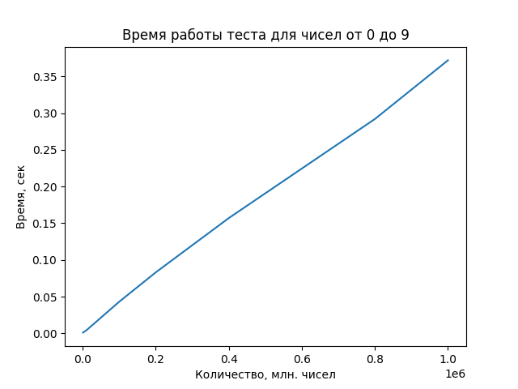
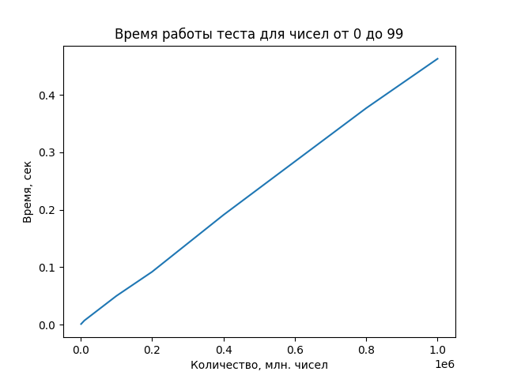
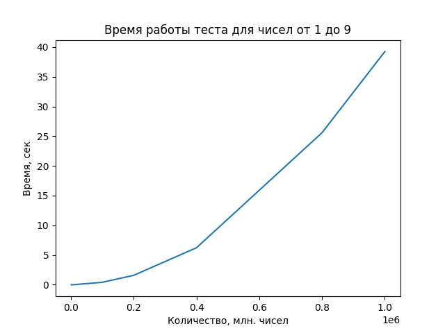
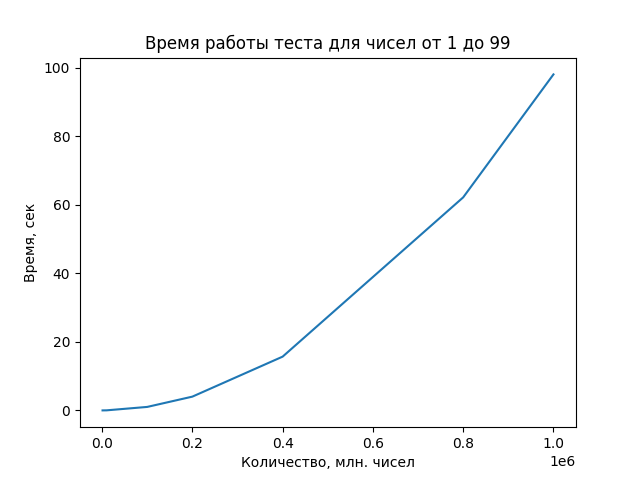
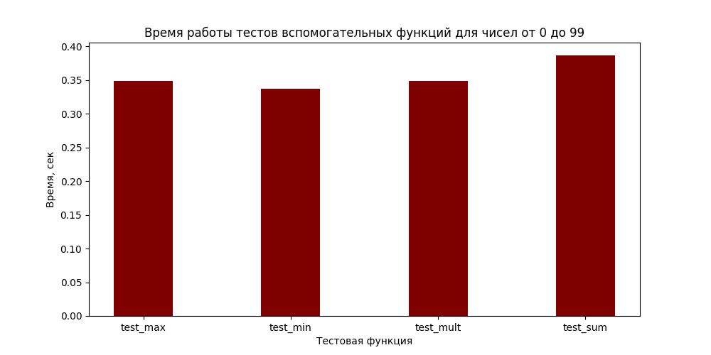
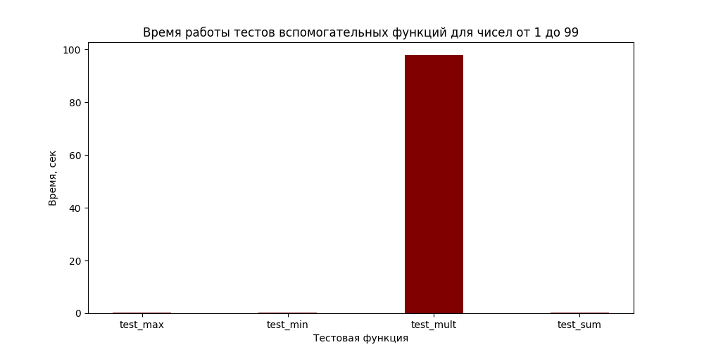

# ТЗ2
# Столяров Артем Григорьевич
# ББИ 226

# Практическое задание по курсу "Технология программирования"

## Задание

  
Техническое задание №2 (ТЗ2)

**Добавляем тесты и разворачиваем простейший CI/CD**
Задание состоит из двух частей. Каждая часть оценивается максимум в 5 баллов. Общий максимальный балл за задание: 5 + 5 = **10 баллов**
### Часть №1 *Тестирование* (стоит 5 баллов из 10)
#### Задание
Реализуйте на `Python` простейшую программу, которая будет считывать из файла числа, а далее отдельными функциями искать среди этих чисел минимальное число, максимальное число, считать их общую сумму и произведение.
Функции должны называться, соответственно `_min` (минимальное число), `_max` (максимальное число), `_sum` (сумма всех чисел), `_mult` (произведение всех чисел).
Числа в файле записаны в одной строке, друг от друга отделены пробелами. В файле есть минимум одно число. Максимально возможное количество чисел в файле - 1 млн.
Для этой программы подготовьте тесты:
- проверяющие корректность работы функций поиска минимума и максимума
- проверяющие корректность работы функций сложения и умножения
- проверяющие скорость работы программы при увеличении размера входного файла (*при увеличении количества чисел в файле*).
#### Пример работы
**В файле**: 1 4 2 3
**Минимальное**: 1
**Максимальное**: 4
**Сумма**: 10 *(1+2+3+4)*
**Произведение**: 24 *(1\*2\*3\*4)*
#### Критерии оценки
- `1 балл`: реализуйте функции чтения из файла, поиска минимального числа, поиска максимального числа, сложения и умножения *всех* чисел из файла
- `1 балл`: реализуйте тесты для проверки корректности функций поиска минимума, максимума, сложения и умножения
- `1 балл`: реализуйте тесты для проверки скорости работы программы при увеличении размера входного файла
- `1 балл`: реализуйте любой другой тест на ваше усмотрение
- `1 балл`: постройте график зависимости времени выполнения от кол-ва чисел в файле (*вы можете измерять время выполнения любой функции из реализованных на ваш выбор*)
### Часть №2 (стоит 5 баллов из 10)
> [Github Actions](https://github.com/features/actions)
> [Travis CI](https://www.travis-ci.com/)
> [Circle CI](https://circleci.com/)
#### Задание
Теперь вам необходимо настроить CI-систему для своего мини-проекта.
#### Критерии оценки
- `1 балл`: заведите репозиторий для своего проекта на [GitHub](https://github.com/). Оформите простейший *README.md* ([туториал по markdown (файлы формата .md)](https://github.com/adam-p/markdown-here/wiki/Markdown-Cheatsheet)). Загрузите в репозиторий файлы своего мини-проекта (код, тесты, *README.md*).
- `1 балл`: подключите к вашему проекту любую CI-систему (**выше есть подсказки с вариантами систем, но мы крайне рекомендуем использовать GitHub Actions в рамках этого задания, только если Ваш семинарист не демонстрировал вам другую систему**). Обеспечьте возможность запуска тестов в ручном режиме (например, по щелчку кнопки в веб-интерфейсе CI-системы)
- `1 балл`: настройте CI таким образом, чтобы прогон тестов запускался автоматически при любом новом коммите в репозиторий вашего проекта
- `1 балл`: сделайте интеграцию CI-системы и вашего репозитория на GitHub: сделайте бэйдж в *README.md*, который будет показывать текущий статус тестов. Для информации смотрите [тут](https://docs.github.com/en/actions/monitoring-and-troubleshooting-workflows/adding-a-workflow-status-badge), [тут](https://www.codeblocq.com/2016/04/Add-a-build-passing-badge-to-your-github-repository/) или в аналогичном доке для выбранной вами CI-системы.  Как выглядят бэйджи в целом, можно посмотреть в любом проекте на GitHub, где они сделаны, например, в [репозитории Telegram](https://github.com/telegramdesktop/tdesktop)
- `1 балл`: сделайте любую интеграцию CI-системы и какого-либо мессенджера (например, `telegram`, `slack`, `msteams` и т.п.). Настройте систему так, чтобы при успешном прохождении теста посылалось сообщение "все ок", при неуспешном - посылалась информация, какие именно тесты не пройдены. **Обратите внимание**, тут не нужно *писать код*, тут нужно взять готовые аддоны / расширения и просто настроить
### Дедлайн
Правила дедлайнов такие же, как и по **ТЗ1** - есть `мягкий` и `жесткий` дедлайны.
**Вариант 1 - если у вас уже прошел семинар №4**
- `Мягкий дедлайн` **09.10**
- `Жесткий дедлайн` **16.10**

## Отчет
### Часть №1 *Тестирование*
- Была реализована программа на Python, с помощью которой можно считывать из файла числа, а далее с помощью отдельных функций искать минимальное/максимальное число, считать общую сумму или произведение.
- Были реализованы тесты, проверяющие корректность работы функций поиска минимума и максимума, функций сложения и умножения.
- Были реализованы тесты, проверяющие скорость работы программы при различных размерах входного файла
- Были реализован тест функции, преобразующей строку с числами в нужный формат
- Был построен график зависимости времени выполнения от кол-ва чисел в файле для функции:
#### Берем числа от 0 до 9

####  Увеличиваем диапазон до 99

#### Исключаем ноль 

####  Увеличиваем диапазон до 99

#### Вывод: исключение нуля экспоненциально увеличивает время работы функции, а следовательно и теста.

#### Проверим зависимость времени работы каждого теста/функции
#### С нулем

#### Без нуля

#### Вывод: Если среди чисел нет нуля, то время работы функции перемножения сильно зависит от количества чисел. При нуле время линейно зависит от количества чисел в файле.
### Часть №2
- Был оформлен README.md
- К проекту была подключена CI-система и обеспечена возможность запуска тестов в ручном режиме
- CI был настроен на автоматическое прохождение тестов при новом коммите
- Был создан бейдж, показывающий текущий статус тестов
- Сделана интеграция CI-системы и мессенджера `telegram`. Имя бота: @UnitTester_bot